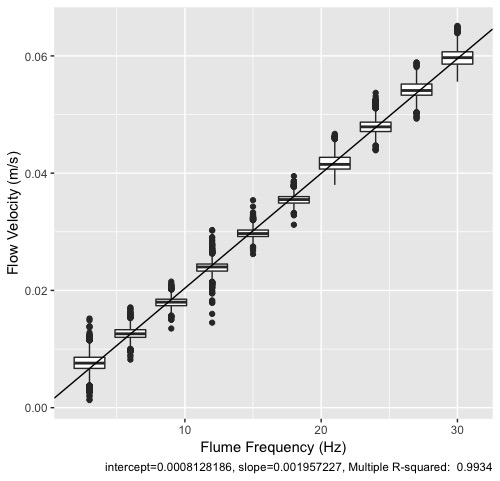

```{r setup, include=FALSE}

knitr::opts_chunk$set(echo = TRUE, fig.pos = "!H", out.extra = "")


```

## Objective(s)

In the interest of documenting our analytic methods, I've decided to make one comprehensive, hopefully lay-readable document including all steps from our raw laboratory data to the model results. I won't be able to include the turbulence analyses in time for our meeting (8/27), but that required Laurel's Matlab script anyways.

## Data sourcing and tidying

### Changes from Version 1 (8/26)

I pared back this section to reduce the page count. Please refer to the original version to see visualizations and more detailed steps and notes.

### Data background

We entered data into Google Sheets as we processed samples in the lab. I downloaded .csv versions of these data in 2019, then made a few modifications as I explored confounders. Today, I added data from runs done in my absence to this dataset. Field names, date syntax, and other conventions weren't kept consistent, so some data wrangling is necessary. I also removed the blank data at the beginning of some files manually.

```{r, message=FALSE, warning=FALSE}

library(tidyverse)

```


```{r}

pumpfiles <- list.files("../data/peristaltic pumps/")
trapfiles <- list.files("../data/sediment traps/")

```

```{r}

pumpdate <- str_sub(pumpfiles,0,6)
trapdate <- str_sub(trapfiles,0,6)

```

In all, five runs are missing sediment trap data, meaning they won't be used in our final, published analyses.

### Suspended sediment data

Let's turn our attention to the suspended concentration data (i.e., pump data).

```{r, message=FALSE, warning=FALSE}

pumpdata <- lapply(pumpfiles, function(x) read_csv(paste0("../data/peristaltic pumps/",x)))

names(pumpdata) <- pumpdate

x <- pumpdata

tidypump <- lapply(seq_along(x), function(i) {
  select(x[[i]], 
         loc = Location, 
         ht = Height,
         t = `time series`,
         mvc = contains("(ppm)")) %>%
    filter(t < 21) %>% #filter a few timepoints outside the normal window 
    mutate(t = (t-min(t)+1)*300, #convert from timestep to seconds
           mvc = as.numeric(mvc), 
           date = as.numeric(names(x)[[i]])) %>%
    filter(mvc<80, mvc>8) #outliers were removed based on the residual graph
  }
  )

pump <- bind_rows(tidypump)

```

So now we have a long table of our pump data (time $\times$ concentration) stratified by run (i.e., treatment), height, and upstream/downstream location.

Aside from a few runs where **part** or **all** of the data don't follow the decay pattern, the results look pretty good! If we repeated runs as necessary to replace those with erroneous data, that shouldn't be a problem. Here I'll narrow down our dataset by knocking out runs with clear issues.

```{r}

pump <- pump %>%

#first 3 runs had starting sediment mass of 100g rather than 200g

    filter(date > 181005) %>%
  
#we can't use runs without sediment mass
  
    filter(as.character(date) %in% trapdate)
  
```

So this leaves 20 rows. Let's join this to our run metadata table.

```{r message=FALSE}

metadata <- read_csv("../data/run_metadata.csv")

pump <- left_join(pump, metadata, by = "date")

```

Now then, let's remove the biofouled runs and a couple runs with other issues, which won't be used in assessing our primary hypothesis about Reynolds number and collector density, and we'll see what we're left with.

```{r}

pumpfinal <- pump %>%
  filter(growth_days==0, date != 190417, dowel_density != "0232")

```

There are certainly no trends jumping out immediately, which isn't necessarily worrisome since exponential decay is hard to compare by eye. More on that later though. 

### Sediment trap data

Data import and wrangling follows a similar structure to the pump data.

```{r, message=FALSE, warning=FALSE}

trapdata <- lapply(trapfiles, function(x) read_csv(paste0("../data/sediment traps/",x)))

names(trapdata) <- trapdate

x <- trapdata

tidytrap <- lapply(seq_along(x), function(i) {
  select(x[[i]], station = 1, pre = contains("pre"), post = contains("post"), sed = contains("sed")) %>%
  mutate(date = names(x)[i]) %>%
  mutate_at(vars(pre,post,sed,date), as.numeric)
  }
  )

trap <- bind_rows(tidytrap) %>%
  filter(!is.na(sed))

```

So, across 21 runs, we had 186 samples. We were set up to collect 9 per run, but traps broke, filters slipped and spilled sediment, et cetera. $186/21 =$ `r 186/21`, so our success rate was actually pretty good, although some of those measurements were probably erroneous despite being measured. 

```{r}

trapfinal <- left_join(trap, metadata, by = "date") %>%
  filter(date %in% pumpfinal$date)

```

### Velocity

We estimated Reynolds number from a flow velocity experiment in the open channel conducted in early 2019.



It looks like there are a lot of outliers, but that's because there are simply a ton of Vectrino points and the distribution clearly has long tails. See how tiny the IQR boxes are, which by definition encompass 50% of points. 

It should also be noted that the back-of-envelope estimate of $v = f / 500$ is extremely close, probably by design.

The data and code for this analysis is MIA at the moment, but should turn up soon.

### Flume volume

The test section is modeled as a rectangular prism, making calculation of volume trivial. However, the water in the flume is in an irregular form. In order to correct for the time water spends flowing outside the test section, where collectors are not acting on particles, we must estimate the total volume of water. We did so using a simple integration of the volumetric flow rate at the drain. We ran an experiment previously in 2018 or 2019, but my physics common sense lapsed: We picked the drain hose up off the ground to take measurements, then stuck it back down in the drain for most of the flow time. This led to an underestimate of about 5-10%. I re-did the analysis. 1st through 4th degree polynomial regression all yield the same volume +/- <0.5%:

```{r}
# flows in ml/s: 
flow <- c(131, 132, 132, 131, 134, 129, 130, 129, 130, 129, 130, 127, 127, 127, 126, 
          123, 126, 125, 124, 125, 127, 125, 123, 122, 125, 124, 118, 123, 125, 125, 
          120, 122, 124, 126, 122, 117, 123, 118, 120, 120, 121, 118, 118, 118, 119, 
          118, 120, 117, 117, 114, 115, 115, 116, 112, 112, 110, 111, 108, 105, 105, 
          102, 100, 100, 102)

# times in fractional hrs of day:  
time <- c(12.13333, 12.21667, 12.28333, 12.41667, 12.5, 12.56667, 12.6, 13.11667,
          13.15, 13.18333, 13.58333, 13.61667, 13.65, 14.25, 14.28333, 14.31667, 
          14.35, 14.38333, 14.68333, 14.71667, 14.75, 14.78333, 14.81667, 14.85, 
          14.88333, 14.93333, 15.35, 15.38333, 15.41667, 15.45, 15.48333, 15.76667, 
          15.8, 15.86667, 15.9, 15.93333, 15.96667, 16.18333, 16.23333, 16.28333, 
          16.31667, 16.33333, 16.36667, 16.55, 16.58333, 16.61667, 16.81667, 16.85, 
          16.9, 16.93333, 16.98333, 17.03333, 17.06667, 17.2, 17.23333, 17.35, 
          17.36667, 17.53333, 17.58333, 17.61667, 17.73333, 17.75, 17.78333, 17.8)

#flow start time:
t_0 <- 11.59166667

#time at which flume was drained to top of test-array holding basin
t_b <- 16.96666667

#time at which basin was drained
t_f <- 17.825

#polynomial model fits:
fits <- lapply(1:4, function(x) {lm(flow ~ poly(time, x, raw = TRUE))})

#finite integral calculator
poly_fin_integr <- function(model,lim1,lim2) {
  sum(coefficients(model)/(1:length(coefficients(model)))*
        lim2^(1:length(coefficients(model))))-
  sum(coefficients(model)/(1:length(coefficients(model)))*
        lim1^(1:length(coefficients(model))))
}

estimates <- lapply(fits, function(x) poly_fin_integr(x, lim1 = t_0, lim2 = t_b))

#convert from mL/s*h to cubic m: 1 mL/s*h = 3600 mL = 3.6 L = 0.0036 cubic m

estimates <- unlist(estimates)*.0036

names(estimates) <- c("linear", "quadratic", "cubic", "4th order")

estimates

```

I rounded off to 2.43 $\text m^3$. The test section has been measured as $1.95 \times .6 \times .4 =$ `r 1.95*.6*.4` $\text m^3$. Hence the corrective factor is `r 2.43/0.468`.

## Modelling for eta (and all the other vars of interest)

So at this point, we really only need `pumpfinal`, `trapfinal`, maybe `metadata` for good measure, the frequency-to-velocity regression coefficients, and individual constants about the physical setup such as dowel diameter, flume volume, starting sediment mass, dynamic viscosity etc.

I'll also mention here that our model is based on the general equation: $$k_{tot} = k_s + k_c + k_{bg}$$ where the k's represent total decay rate and portions of it due to settling, collection, and (background) settling in the rest of the flume outside the test section, respectively.

### NEW ADDITION: Uncertainty propogation

Here is a nice function found on StackExchange.com, which performs error propogation in R using derivatives:

```{r}

mutate_with_error = function(.data, f) {
  exprs = list(
    # expression to compute new variable values
    deparse(f[[3]]),
    
    # expression to compute new variable errors
    sapply(all.vars(f[[3]]), function(v) {
      dfdp = deparse(D(f[[3]], v))
      sprintf('(d%s*(%s))^2', v, dfdp)
    }) %>%
      paste(collapse='+') %>%
      sprintf('sqrt(%s)', .)
  )
  names(exprs) = c(
    deparse(f[[2]]),
    sprintf('d%s', deparse(f[[2]]))
  )
  
  .data %>%
    # the standard evaluation alternative of mutate()
    mutate_(.dots=exprs)
}

```


### k_tot (total time-decay rate)

We estimate k_tot from our pump data by linear regression of `log(mvc)`:

```{r, warning=FALSE}

library(lme4)

fits <- lmList(data = pumpfinal, log(mvc)~t | date)

summary(fits)

```

The `t` coeffient estimates are the `k_tot` values in units $\text s^{-1}$, no transformation needed aside from a sign change ($\log(\bar{\phi})=\log(\phi_0e^{-kt}) = log(\phi_0)-kt$).

All the t values are high, though the coefficient t-values are relative to 0, meaning they're really just expressing that we're very certain we did indeed add sediment (phew!). But let's see what the fits look like with the data:

```{r}

cbind(pumpfinal, pred = predict(fits)) %>%
  ggplot() +
  geom_point(aes(x = t, y = mvc), size = .75, alpha = .5) +
  geom_line(aes(x = t, y = exp(pred)), color = "red") +
  facet_grid(pump_freq~dowel_density) +
  scale_x_continuous(breaks = c(0,3000,6000), limits = c(0,6000))
 

```

As I noticed back in early 2019, these curves seem to hint at a U-shaped pattern in the residuals.

```{r}

cbind(pumpfinal, resid = residuals(fits)) %>%
  ggplot(aes(x = t, y = resid)) +
  geom_point() +
  geom_smooth()

```

I think this is simply an artifact of nonlinear processes not accounted for in the exponential model. As an example of what I mean, let's imagine there were a hidden variable called "stickiness" differentiating walnut shell particles from one another. If by way of accellerated settling due to floculation, or accellerated collection, those particles were disproportionately removed from suspension early in the timespan of the experiment, the average physical properties of the suspended sediment would change over its course. It also seems likely to me that as sediment adheres to collectors, their efficiency decreases on account of their having less open surface area.

Whatever the explanation is, we (and other researchers using the exponential model) assume it is uniform across our independent variables. I don't know how safe that assumption is, but that'll have to wait for a future paper. It might be testable from our data but `n = 12` seems a bit of a small sample. Then again, we've probably done more like `n = 100` runs over the entire history of the project.

Aside from that U-curve, the fit seems reasonably good. Though there are high **absolute** measurements at the beginning, on the **log-scale** they are far less influential than the lower values (`mvc < 10`) at the end. Removing the lower outliers towards the end (`t > 3000`) might be worth trying later if our results don't satisfy.

So then, k_tot as a function of our independent vars:

```{r}

fitdata <- coefficients(fits) %>%
cbind(date = as.numeric(row.names(coefficients(fits)))) %>%
  left_join(metadata, by = "date")

fitdata %>%
  ggplot(aes(x = dowel_density, y = pump_freq, fill = -t, label = round(-t,7))) +
    geom_tile() + 
    geom_text() +
  scale_fill_gradient(low = "red", high = "white")

```

Mixed feelings. On the one hand it's reassuring that aside from the switcharoo at 20 Hz, all runs with dowels had greater k_t than runs without. However, it seems like there's some serious variance. **What confounders could we be missing???**

### THE PROBLEM IN A NUTSHELL

Having a greater decay rate for the control run than the dowel run, by an amount greater than the difference in $k_s$ between the two runs, implies a negative $k_c$. This seems unrealistic, or at least very out of step with our operating theory. For the rest of this analysis, I'll do what I slipped into my past code and then forgot about: leave out that control run and estimate its values as the mean of the other controls (it does lie at the mean of their independent vars. so weighting the average seems unnecessary). Not ideal! Maybe we should give this set of parameters another shot? But I don't feel great about cherrypicking experimental results that way either.

```{r}

# THIS CODE WAS USED IN THE FIRST VERSION BUT SHOULD BE LEFT OUT OF ERROR PROPOGATION VERSION

# 
# fitdata[fitdata$date==190802,"t"] <- (fitdata[fitdata$date==190729,"t"] + 
#                                         fitdata[fitdata$date==190321,"t"])/2
# 
# fitdata

```


### k_s (time-decay due to settling)

$$ m_s = \frac{k_s}{k_{tot}}(1-e^{-kT})m_0 $$

Or, expressed for $k_s$, $$k_s = \frac{m_s}{m_0}(\frac{1}{1-e^{-kT}})k_{tot}$$

where $m_s$ is mass settled in the test section (estimated from sediment traps), $m_0$ is starting sediment mass (200 g for this study), and $T$ is the total exposure time of the sediment traps (100 min, i.e., 6000 s, for this study).

```{r}

hist(trapfinal$sed, breaks = 10, density = 10)

```

There aren't really any clear outliers, as we established in the boxplots above. While splines might be our final tool, for now an average will do.

```{r}

final <- trapfinal %>%
  group_by(date) %>%
  summarise(m_trap = mean(sed)/1000) %>% #average sediment in trap converted from mg to g
  mutate(m_s = m_trap*1.95*.6/(pi*.0127^2)) %>% #times test section area divided by area of 1 trap
  left_join(fitdata, by = "date") %>%
  mutate(k_s = m_s/200/(1-exp(t*6000))*(-t))

final %>%
  ggplot(aes(x = dowel_density, y = pump_freq, fill = k_s, label = round(k_s,7))) +
    geom_tile() + 
    geom_text() +
  scale_fill_gradient(low = "red", high = "white")

```

If we're not using the $k_{tot}$ from the 20 Hz control, I think we should probably do the same with k_s, not least because it gives us linear $k_{bg}$ values, though this all still feels a little iffy.

```{r}

# THIS CODE WAS USED IN THE FIRST VERSION BUT SHOULD BE LEFT OUT OF ERROR PROPOGATION VERSION

# final[final$date==190802,"k_s"] <- (final[final$date==190729,"k_s"] + 
#                                       final[final$date==190321,"k_s"])/2

```

Gladly, settling across the dowel treatments does seem to decrease, with a less clear pattern across flow velocity.

### k_bg (time-decay due to settling in the rest of the flume)

In control runs, $k_c = 0$, so we can estimate the decay rate in the rest of the flume as $k_{bg} = k_{tot}-k_s$

```{r}

bgvals <- final %>%
  filter(dowel_density=="0000") %>%
  transmute(pump_freq, k_bg = -t - k_s) %>%
  arrange(pump_freq)

bgvals
  
```

To add it to the table:

```{r}

final <- left_join(final, bgvals, by = "pump_freq")

```

### k_c (time-decay due to collection)

So, now that we have our values in the table, k_c is just a subtraction away:

```{r}

final <- final %>%
  mutate(k_c = -t - k_s - k_bg)

final %>%
  ggplot(aes(x = dowel_density, y = pump_freq, fill = k_c, label = round(k_c,7))) +
    geom_tile() + 
    geom_text() +
  scale_fill_gradient(low = "red", high = "white")

final %>%
  ggplot(aes(x = as.numeric(pump_freq), y = k_c, color = dowel_density)) +
  geom_line()

```

Unlike the calculation with the measured values at the 20 Hz control, all k_c are in the green, but the pattern is still quite odd.

### eta

```{r}

#temp in flume measured at 22.2C with a calibrated thermometer
#plugged into https://www.engineeringtoolbox.com/water-dynamic-kinematic-viscosity-d_596.html
visc = 9.509e-7 #kinematic viscosity, m2/s

d = .003175 #dowel diameter

final <- final %>%
  transmute(frontal_area = as.numeric(dowel_density)*.003175, 
            u = as.numeric(pump_freq)/500, #velocity 
            Re = u*.003175/visc, #Reynolds #
            k_t = -t, 
            k_c, k_s, k_bg) %>%
  mutate(eta = k_c/u/frontal_area) %>%
  mutate(eta = eta * 2.43/(1.95*.4*.6)) # don't forget to correct for time out of test section!

final %>%
  filter(frontal_area != 0) %>%
  ggplot(aes(x = Re, y = eta, color = factor(frontal_area))) +
  geom_line() +
  geom_point()

```


## Possible additions

- Turbulence data
    - The calculations are done 
    - But it might be good to include here for the sake of comprehensiveness

